**Ultrasonics Water Meter**

User Manual 1.1

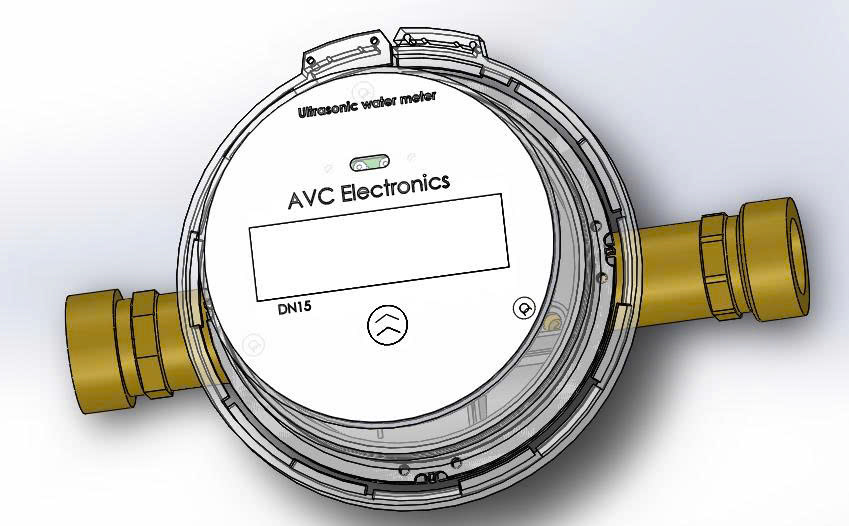

AVC Ultrasonic Water Meter

**Ultrasonics Water Meter**

AVC LoRaWAN Series

User Manual

\newpage

**Ultrasonics Water Meter**

AVC LoRaWAN Series

**User Manual**

Document No.: 08-2025 VN  
Issue date: 2025.08  
Revision: VA.01

**AVC Electronics Inc.**  
16600 Harbor Blvd. Suite F  
Fountain Valley, CA 92708  
infomation@acv.com

Copyright 2025 and Liability Disclaimer  
AVC Electronics and its subsidiaries reserve the right to change specifications and/or descriptions without prior notice. AVC Electronics and its subsidiaries shall not be liable for inaccuracies or errors in this manual.

⚠️ **Attention!**

> - Please carefully read this manual before operating this product.
> - Do not open or modify any hardware, as this may cause irrecoverable damage.
> - Do not use this product if you suspect any malfunction or defect.
> - Do not use this product with corrosive media or in environments with strong vibration.
> - Operate this product strictly within the specified parameters.
> - Only trained or qualified personnel are permitted to perform product-related services.

⚠️ **Use with Caution!**

> - Be mindful of electrical safety. Even at low voltage, electrical shock may still cause unexpected damages.
> - The liquid to be measured must be clean and free of particles, as even small particles may accumulate inside the flow channel, resulting in metrology errors, clogging, or irrecoverable damage.
> - Do not apply this product to any unknown or unspecified liquids that may cause damage.
> - Pay attention to bubbles or cavitation inside the fluid, whether visible or invisible, as they may lead to inaccurate or erroneous outputs.

\newpage

## Table of Contents

1. [Overview](#1-overview)  
2. [Receipt and Unpacking](#2-receipt-and-unpacking)  
3. [Knowing the Product](#3-knowing-the-product)  
4. [Technical Specifications](#4-technical-specifications)  
5. [Installation](#5-installation)  
6. [Basic Operation](#6-basic-operation)  
7. [Display](#7-display)  
8. [LoRaWAN Communication](#8-lorawan-communication)  
9. [Warranty and Liability](#9-warranty-and-liability)  
10. [Service Contact and Information](#10-service-contact-and-information)

---

## 1. Overview

This manual provides essential information for the AVC Ultrasonic Water Meter used in water flow measurement applications. It includes product performance, installation, operation, maintenance, troubleshooting, and technical support.

The meter is designed with Time-of-Flight ultrasonic sensing technology, providing high accuracy across a wide dynamic range. It is compatible with AMR/AMI remote metering systems.

---

## 2. Receipt and Unpacking

Upon receiving the package:

1. Inspect the outer box for visible damage before opening.
2. If damage is found, notify the shipping carrier, distributor, or AVC technical support immediately.
3. If the box is intact, verify that the delivered meter model matches your order (for example DN15, LoRaWAN version).

Verify product integrity immediately after unboxing. If any defect is confirmed, replacement is arranged through official sales channels.

---

## 3. Knowing the Product

### 3.1 Product Description

The AVC Ultrasonic Water Meter is a compact smart meter for clean water applications. The device supports remote data transmission and long-term field operation.

{ width=85% }

*Figure: 3D view of AVC ultrasonic water meter.*

### 3.2 Mechanical Dimensions

Refer to the dimensional drawing for the exact model (DN15/DN20/DN25) included in your product pack or product datasheet.

---

## 4. Technical Specifications

All specifications apply under calibration conditions at 20 degC and 101.325 kPa absolute pressure using clean water. The device is factory-calibrated in horizontal installation mode.

| Spec | DN15 | DN20 | DN25 | Unit |
|---|---:|---:|---:|---|
| Class | 2.0 | 2.0 | 2.0 | % |
| Q3 | 2.5 | 4.0 | 6.3 | m3/h |
| Q3/Q1 | 400/250 | 400/250 | 400/250 | - |
| Q1 | 6.25/10 | 10/16 | 15.8/25.2 | L/min |
| Q2 | 10/16 | 16/25.6 | 25.2/40.4 | L/min |
| Q4 | 3.125 | 5.0 | 7.9 | m3/h |
| Flowpipe | U10 D5 | U10 D5 | U10 D5 | - |
| Pressure | MAP16 | MAP16 | MAP16 | - |
| Pressure Loss | Delta40 | Delta40 | Delta40 | - |
| Temperature | T30/T50 | T30/T50 | T30/T50 | - |
| Protection Level | IP68 | IP68 | IP68 | - |
| Communication | LoRaWAN | LoRaWAN | LoRaWAN | - |

---

## 5. Installation

Do not open, disassemble, or modify the product. Unauthorized handling may cause malfunction or permanent damage.

Installation guidance:

1. Install in a low-vibration section of pipeline.
2. Avoid locations with strong electromagnetic fields.
3. Horizontal installation is recommended.
4. If vertical installation is used, ensure the meter section stays fully filled with water.
5. Clean the pipeline before installation (remove rust, particles, oil, and foreign matter).
6. Ensure connectors are intact and leak-free.
7. Avoid sharp bends and pipe twisting after installation.
8. Follow the flow-direction arrow printed on the meter body.

**Note:** The ultrasonic water meter is not suitable for corrosive liquids or high-viscosity fluids.

---

## 6. Basic Operation

### 6.1 Check Product Specifications

Before operation, verify:

1. The meter pressure rating is not lower than system pressure.
2. Flow conditions are within the rated flow range.
3. The measured liquid is clean water without corrosive agents or high viscosity.

**Warning:** Exceeding rated pressure may permanently damage the device.

### 6.2 Check Pipeline System

For safe and accurate operation:

1. Ensure the pipe is clean and free of particles, rust, grease, and debris.
2. Install an upstream filter when required.
3. Check all joints for leakage.
4. Confirm the meter orientation matches the flow-direction arrow.

### 6.3 Check for Leakage

Before commissioning, perform leak testing with pressurized air or nitrogen. Any leakage must be fixed before normal operation.

---

## 7. Display

### 7.1 Display

The LCD presents key data such as cumulative volume, instantaneous flow, operating status, and communication indicators.

### 7.2 Symbols Description

Display symbols vary by firmware profile and may include communication status, low battery, reverse flow, and fault/alarm indications.

---

## 8. LoRaWAN Communication

This LoRaWAN meter supports remote telemetry upload and periodic reporting through LoRaWAN network infrastructure.

Deployment checklist:

1. Verify `DevEUI`, `JoinEUI/AppEUI`, and `AppKey` (OTAA) are correctly provisioned.
2. Verify LoRaWAN region/channel plan matches network server settings.
3. Configure reporting interval based on battery life and application needs.
4. Validate payload decoding on the application server.
5. Confirm RSSI/SNR and uplink success at the installation site.

### 8.1 Specific Analysis of Upload Protocol

The following example frame is used to explain byte-level decoding.

```text
FE FE FE 68 10 78 56 34 12 00 00 00 81 91 92 1F 01 00 30 06 15 03 18 28 03 DD 05
03 F8 1F 00 2B 18 06 00 2B 09 03 00 35 00 50 01 00 25 00 08 00 00 68 01
00 00 00 00 03 2B 18 06 00 00 00 2B 09 03 00 00 00 15 03 18 2B 18 05 00
00 2B 09 02 00 05 00 00 00 00 14 03 18 2B 18 04 00 00 2B 09 01 00 00 00
13 03 18 A0 05 E0 01 3C A0 05 64 00 62 00 62 00 01 15 00 92 29 04 00 50 25
18 11 86 89 30 50 82 45 40 81 64 08 00 00 28 03 DD 05 01 00 FF FF 2E EB 8C 16
```

### 8.2 Frame Header and Fixed Fields

- **Raw Data:** `68`  
	**Decoded:** frame start symbol (`68H`)
- **Raw Data:** `10`  
	**Decoded:** instrument type `T`
- **Raw Data:** `78 56 34 12 00 00 00`  
	**Decoded:** address `A0-A6` (BCD, little-endian) -> `00000012345678`
- **Raw Data:** `81`  
	**Decoded:** control code `C`
- **Raw Data:** `91`  
	**Decoded:** data length field `L`

Data section starts with:

```text
92 1F 01 00 30 06 15 03 18 28 03 DD 05 ...
```

- **Raw Data:** `92`  
	**Decoded:** data identifier `DI0`
- **Raw Data:** `1F`  
	**Decoded:** data identifier `DI1`
- **Raw Data:** `01`  
	**Decoded:** serial number `SER` (`00` = key trigger, `01-250` = serial index)
- **Raw Data:** `00 30 06 15 03 18`  
	**Decoded:** timestamp `2018-03-15 06:30:00`
- **Raw Data:** `28 03`  
	**Decoded:** protocol number `0x0328 = 808`
- **Raw Data:** `DD 05`  
	**Decoded:** status word number `1501`
- **Raw Data:** `03 F8 1F 00`  
	**Decoded:** identification code

### 8.3 Data Area Definition

- **Raw Data:** `2B 18 06 00 00`  
	**Decoded:** forward cumulative flow = `0.618 m3`
- **Raw Data:** `2B 09 03 00 00`  
	**Decoded:** reverse cumulative flow = `0.309 m3`
- **Raw Data:** `35 00 50 01 00`  
	**Decoded:** instantaneous flow = `1.5000 m3/h` (`35` is unit code m3/h)
- **Raw Data:** `05 25 00 00`  
	**Decoded:** water temperature = `25.05 C`
- **Raw Data:** `08 00`  
	**Decoded:** working time = `8 h`
- **Raw Data:** `68 01`  
	**Decoded:** supply voltage, unit `0.01 V` (`0x0168 = 3.60 V`)
- **Raw Data:** `00 00`  
	**Decoded:** status word 1
- **Raw Data:** `00 00`  
	**Decoded:** status word 2
- **Raw Data:** `00`  
	**Decoded:** working mode (`00` no valve, `01` remote control, `02` prepaid)
- **Raw Data:** `03`  
	**Decoded:** number of daily historical records

### 8.4 Historical Frozen Data (Example)

Record 1 (frozen date 2018-03-15):

- **Raw Data:** `2B 18 06 00 00`  
	**Decoded:** forward frozen flow = `0.618 m3`
- **Raw Data:** `2B 09 03 00 00`  
	**Decoded:** reverse frozen flow = `0.309 m3`
- **Raw Data:** `00 00`, `00 00`  
	**Decoded:** status word 1 and status word 2

Record 2 (frozen date 2018-03-14):

- **Raw Data:** `2B 18 05 00 00`  
	**Decoded:** forward frozen flow = `0.518 m3`
- **Raw Data:** `2B 09 02 00 00`  
	**Decoded:** reverse frozen flow = `0.209 m3`
- **Raw Data:** `00 00`, `00 00`  
	**Decoded:** status word 1 and status word 2

Record 3 (frozen date 2018-03-13):

- **Raw Data:** `2B 18 04 00 00`  
	**Decoded:** forward frozen flow = `0.418 m3`
- **Raw Data:** `2B 09 01 00 00`  
	**Decoded:** reverse frozen flow = `0.109 m3`
- **Raw Data:** `00 00`, `00 00`  
	**Decoded:** status word 1 and status word 2

### 8.5 Flow Unit Codes

| Code | Flow Unit |
|---|---|
| `29` | `0.00001 m3` |
| `2A` | `0.0001 m3` |
| `2B` | `0.001 m3` |
| `2C` | `0.01 m3` |
| `2D` | `0.1 m3` |
| `2E` | `1 m3` |

### 8.6 Communication and Statistics Fields

- **Raw Data:** `A0 05`  
	**Decoded:** reporting interval = `0x05A0 = 1440 min` (1 day)
- **Raw Data:** `E0 01`  
	**Decoded:** upload delay = `0x01E0 = 480 min` (8 hours)
- **Raw Data:** `3C`  
	**Decoded:** upload delay = `60 s`
- **Raw Data:** `A0 05`  
	**Decoded:** meter reading interval = `1440 min`
- **Raw Data:** `64 00`  
	**Decoded:** total uploads = `100`
- **Raw Data:** `5A 00`  
	**Decoded:** successful uploads = `90`
- **Raw Data:** `62 00`  
	**Decoded:** total meter readings = `98`
- **Raw Data:** `62 00`  
	**Decoded:** successful meter readings = `98`
- **Raw Data:** `01`  
	**Decoded:** previous frame validity (`00` invalid, `01` valid)
- **Raw Data:** `15`  
	**Decoded:** RSSI = `21`
- **Raw Data:** `00 00`  
	**Decoded:** module type field (`00`, `01`, `02` by firmware profile)

### 8.7 Device and Network Identifiers

- **Raw Data (ICCID):** `92 29 04 00 50 25 18 11 86 89`  
  **Decoded:** `8986111825500042992`
- **Raw Data (IMEI):** `30 50 82 45 40 81 64 08 00 00`  
  **Decoded:** `864814045825030`
- **Raw Data:** `28 03`  
  **Decoded:** protocol version = `808`

### 8.8 Checksum and Frame End

- **Decoded:** data-block verification code (example) = `0xEB`
- **Raw Data:** `8C`  
	**Decoded:** checksum `CS`
- **Raw Data:** `16`  
	**Decoded:** frame end symbol (`16H`)

Checksum note:

- Use byte accumulation in binary arithmetic.
- Ignore overflow beyond `FFH`.

### 8.9 Status Word Definition (IOTST1501.2)

First byte:

| Bit | Definition | Description |
|---|---|---|
| D7 | Reverse measurement | `0`: Positive, `1`: Reverse |
| D6 | Flow sensor malfunction or air in pipe | `0`: Normal, `1`: Fault |
| D5 | Temperature sensor failure | `0`: Normal, `1`: Fault |
| D4 | Water pipe leakage fault | `0`: Normal, `1`: Fault |
| D3 | Water pipe burst fault | `0`: Normal, `1`: Fault |
| D2 | Main power status | `0`: Normal, `1`: Undervoltage |
| D1 | Reserved | Reserved |
| D0 | Reserved | Reserved |

Second byte:

| Bit | Definition | Description |
|---|---|---|
| D7 | Verification status | `0`: Non-calibrated, `1`: Verification |
| D6 | Reserved | `0` |
| D5 | Reserved | `0` |
| D4 | Reserved | `0` |
| D3 | Reserved | `0` |
| D2 | Reserved | `0` |
| D1 | Reserved | `0` |
| D0 | Reserved | `0` |

### 8.10 LoRaWAN Gateway and LoRaWAN Server Configuration (Step-by-Step)

Use this procedure when deploying the AVC LoRaWAN Ultrasonic Water Meter into a new system.

#### A. Gateway Configuration

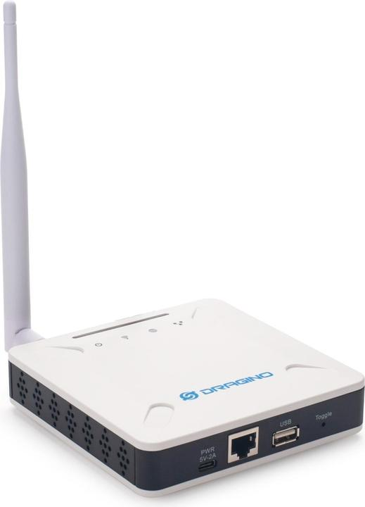{ width=85% }

*Figure: LoRaWAN gateway connection overview.*

LPS8N quick-access notes (Dragino):

- First boot WiFi AP is typically `dragino-xxxxxx`.
- Default AP access IP is typically `10.130.1.1`.
- Typical Web UI URL is `http://10.130.1.1` (or `http://<gateway-ip>:8000` depending firmware mode).
- Web UI default account is `root` / `dragino`.
- If IP is lost, use Ethernet fallback access method from Dragino troubleshooting guide.

1. Power on the gateway and connect WAN/LAN backhaul.
2. Log in to the gateway management UI.

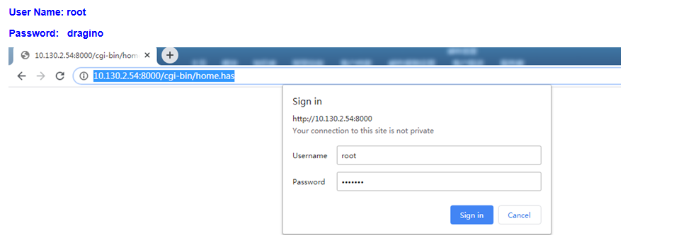{ width=85% }

*Figure: Access gateway Web UI login page.*

3. Set network uplink mode in `Network` page (WAN DHCP / WiFi Client / Cellular backup, depending on deployment).

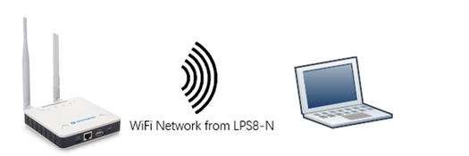{ width=85% }

*Figure: Configure gateway WAN/WiFi uplink and verify internet path.*

4. Confirm Internet connectivity in the gateway `Home` or `Network Status` page before LoRaWAN setup.
5. Set the correct `Region` and `Frequency Plan` (for example `AS923`, `EU868`, `US915`) to match your server and end-devices.
   - In Dragino UI, frequency settings are under `LoRa -> LoRa`.
6. Configure packet forwarder mode:
	- UDP Packet Forwarder, or
	- Basic Station (recommended when supported by server).
   - In Dragino UI, this is under `LoRaWAN -> LoRaWAN` or `LoRaWAN -> Basic Station`.
7. Set server endpoint parameters:
	- Server address (IP/FQDN)
	- Uplink port / downlink port (for UDP mode)
	- TLS certificates (for Basic Station mode, if required)
   - Ensure gateway server/cluster matches the LoRaWAN server side (for example TTN cluster).

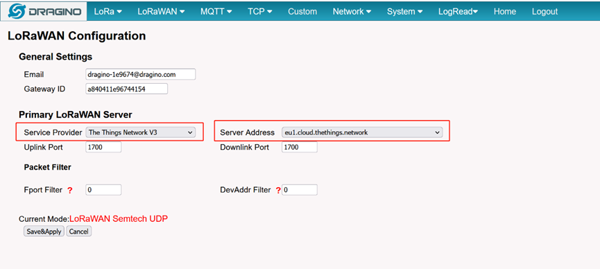{ width=85% }

*Figure: Configure LoRaWAN server endpoint in gateway settings.*

8. Set gateway EUI and verify it matches the value used on the server.

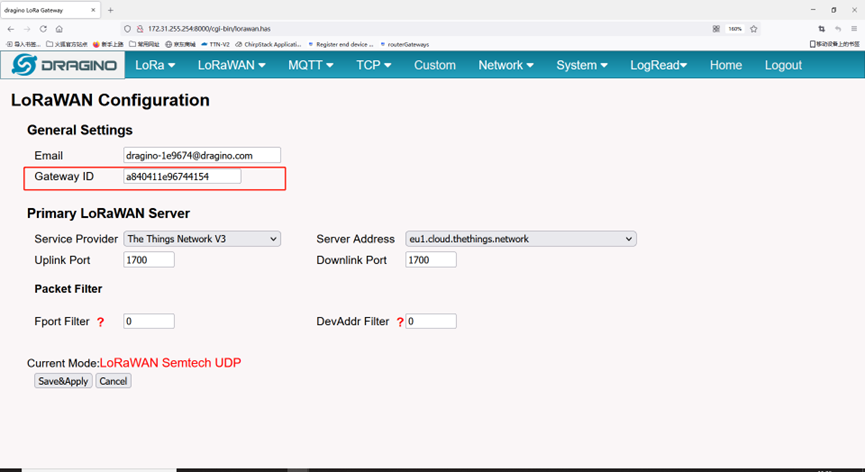{ width=85% }

*Figure: Locate and verify Gateway EUI / Gateway ID.*

9. Click `Save & Apply`, then reboot/restart packet forwarder if required.
10. Confirm gateway status is `Online` in the LoRaWAN server dashboard.

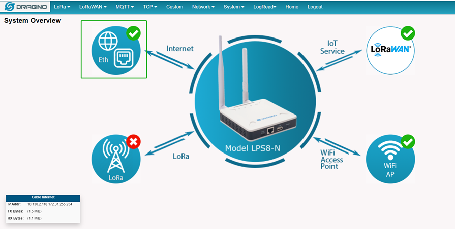{ width=85% }

*Figure: Gateway online and connected to LoRaWAN server.*

11. Check `LogRead -> Gateway Traffic` / `LogRead -> LoRa Log` to confirm packets are being forwarded.

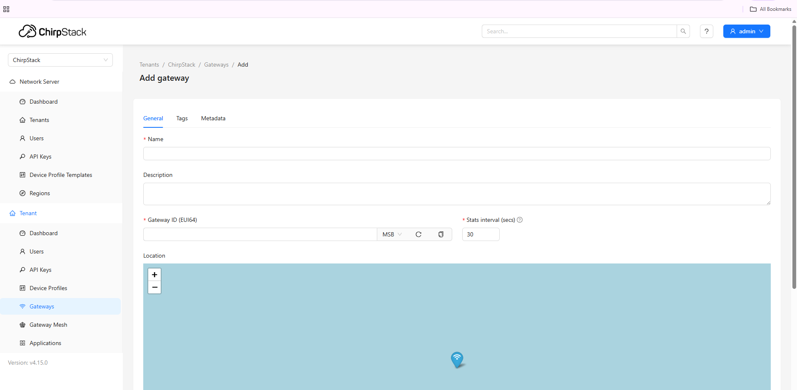{ width=85% }

*Figure: Add gateway configuration in ChirpStack.*

#### B. LoRaWAN Server Configuration

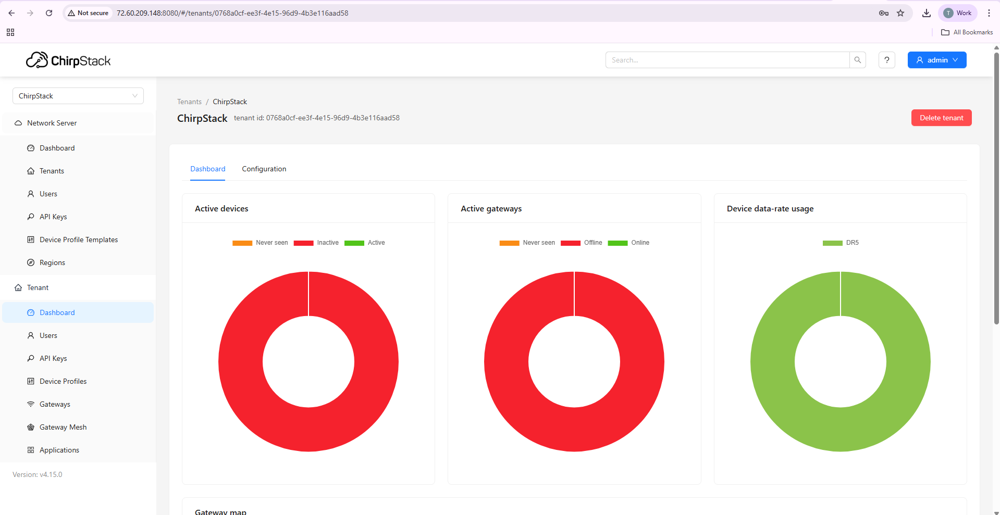{ width=85% }

*Figure: LoRaWAN server (ChirpStack) overview.*

1. Create a `Tenant/Organization` (if required by your platform).
2. Add the gateway using correct `Gateway EUI` and region profile.
3. Create an `Application` for water meters (for example `ACV-WM-App`).
4. Create a `Device Profile` with:
	- LoRaWAN version (for example 1.0.3 / 1.1)
	- Regional parameters revision
	- OTAA activation mode
	- Class A operation
5. Add device using:
	- `DevEUI`
	- `JoinEUI/AppEUI`
	- `AppKey`
6. Configure uplink codec/decoder based on your payload protocol.
7. Set data destination integration:
	- MQTT, HTTP webhook, or cloud platform endpoint.
8. Trigger a join and check:
	- Join request / join accept success
	- First uplink frame received
	- Frame counter increasing normally

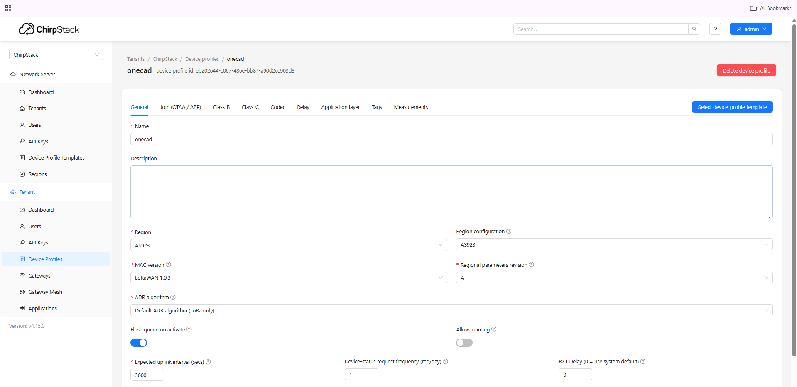{ width=85% }

*Figure: Create device profile in ChirpStack.*

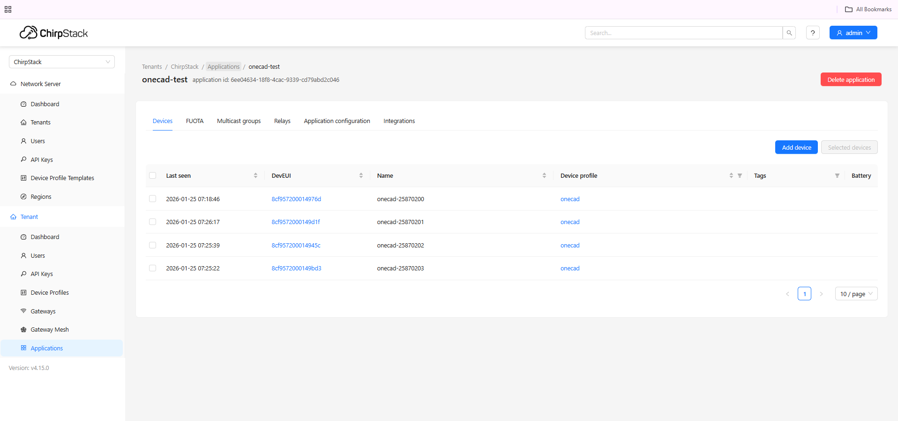{ width=85% }

*Figure: Add water meter device in ChirpStack.*

#### C. Field Validation Checklist

1. Confirm RSSI and SNR are within stable range for your site.
2. Verify reported interval matches configured reporting cycle.
3. Validate decoded values (flow, temperature, status word) against expected test data.
4. Send one downlink command (if enabled) and verify device response in next uplink.
5. Record commissioning result: device ID, gateway, location, and timestamp.

---

## 9. Warranty and Liability

AVC Electronics provides warranty service according to applicable sales terms and product policy.

Warranty does not cover:

1. Improper installation or usage.
2. Unauthorized disassembly or modification.
3. Operation outside specified environmental or fluid conditions.
4. Transport damage, misuse, or external force events.

---

## 10. Service Contact and Information

AVC Electronics is committed to product quality and customer support.

**Customer service and order contact:**  
AVC Electronics Inc.  
16600 Harbor Blvd. Suite F  
Fountain Valley, CA 92708  
Email: infomation@avcelectronic.com

For returns or factory service (including calibration), request an RMA before shipping products. Include product status details and clearly mark the RMA on the package.

For updates, visit: www.acvelectronic.com
