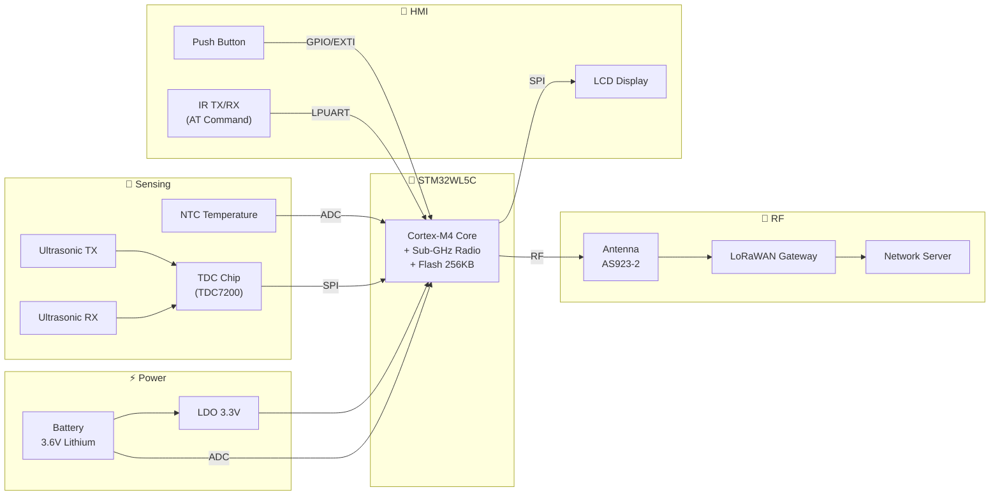
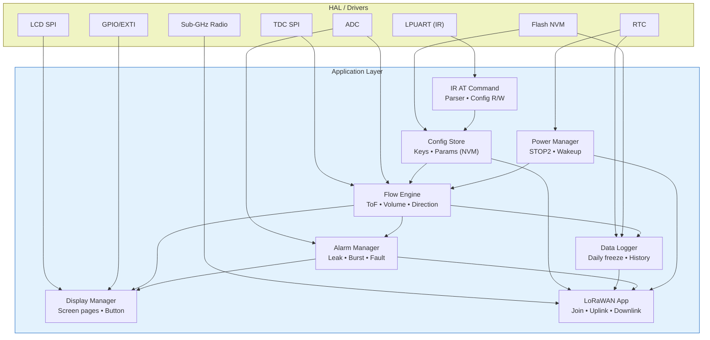
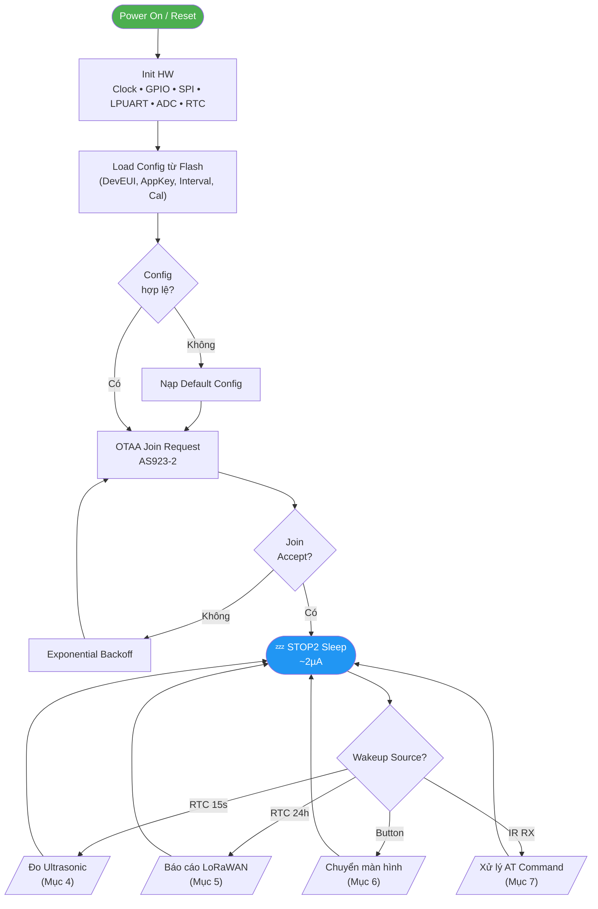
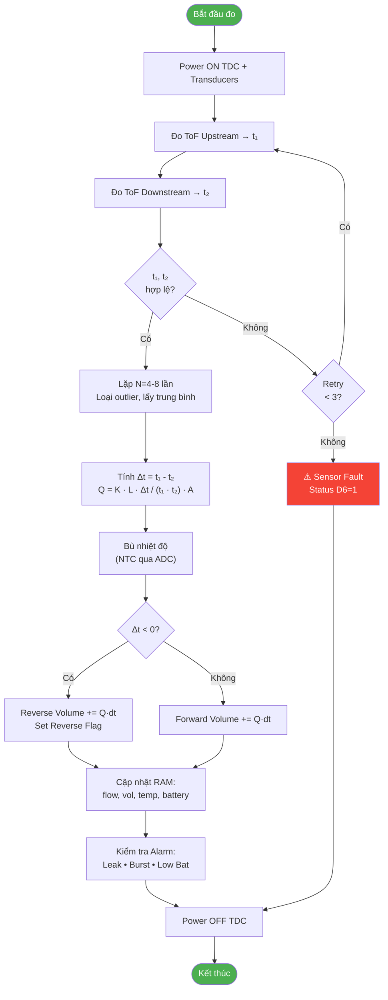
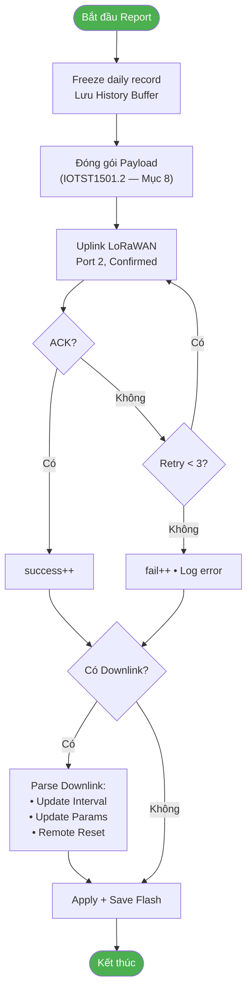
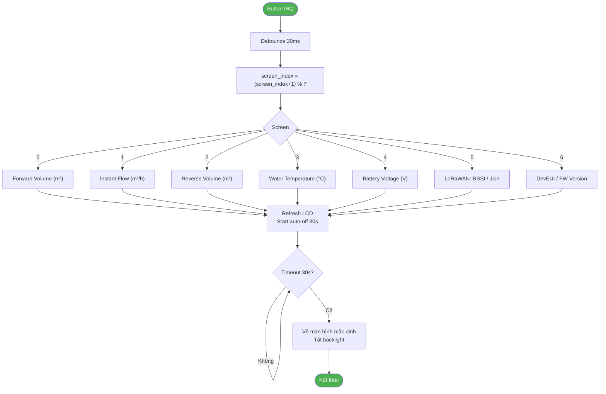
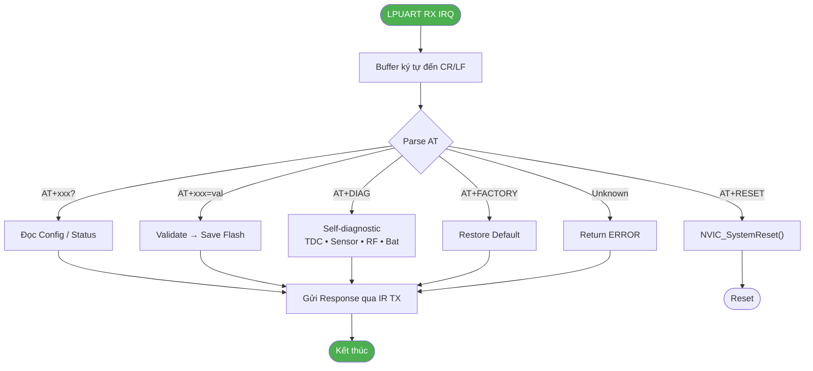

# Firmware Architecture — AVC Ultrasonic Water Meter

**MCU:** STM32WL5C  •  **Radio:** LoRaWAN AS923-2 (Việt Nam)  •  **Pipe:** DN15

---

## 1. Sơ đồ khối hệ thống

---

## 2. Kiến trúc Firmware (HAL + Application)

---

## 3. Lưu đồ giải thuật chính

---

## 4. Đo lường Ultrasonic (Time-of-Flight)

---

## 5. Báo cáo LoRaWAN

---

## 6. Xử lý nút ấn — Chuyển màn hình

---

## 7. Xử lý IR AT Command

---

## 8. Cấu trúc Uplink Payload (IOTST1501.2)

```mermaid
flowchart LR
    F1["68H<br/>Start"] --> F2["Type<br/>10H"] --> F3["Addr<br/>7B BCD"] --> F4["Ctrl<br/>81H"] --> F5["Len"] --> F6["Header<br/>DI0/DI1/SER<br/>+Timestamp"]
    F6 --> F7["Forward<br/>Vol 5B"] --> F8["Reverse<br/>Vol 5B"] --> F9["Instant<br/>Flow 5B"] --> F10["Temp<br/>4B"] --> F11["WorkTime<br/>2B"] --> F12["Vbat<br/>2B"]
    F12 --> F13["Status<br/>4B"] --> F14["Daily<br/>History"] --> F15["Comm<br/>Stats"] --> F16["CS"] --> F17["16H<br/>End"]
```

---

## 9. Chế độ hoạt động & năng lượng

| Chế độ | Trigger | Thời gian | Dòng | Mô tả |
|---|---|---|---|---|
| **STOP2 Sleep** | Mặc định | ~99.9% | ~2 µA | RAM giữ, RTC chạy |
| **Measure** | RTC 15 s | ~50 ms | ~15 mA | Đo ToF + tính flow |
| **Report** | RTC 24 h | 2–5 s | ~120 mA (TX) | Uplink LoRaWAN |
| **Display** | Button | 30 s | ~5 mA | LCD bật |
| **IR Config** | IR RX | Theo session | ~10 mA | AT command |
| **Join** | Boot / Rejoin | 3–10 s | ~120 mA (TX) | OTAA |

**Wakeup sources từ STOP2:** RTC Alarm A (measure), RTC Alarm B (report), EXTI button, LPUART RX (IR).

---

## 10. Bảng AT Commands (IR Interface)

| Command | Mô tả |
|---|---|
| `AT` | Test connection → `OK` |
| `AT+DEVEUI?` / `AT+DEVEUI=<hex>` | Đọc / Ghi DevEUI |
| `AT+APPEUI?` / `AT+APPEUI=<hex>` | Đọc / Ghi JoinEUI |
| `AT+APPKEY=<hex>` | Ghi AppKey (32 hex) |
| `AT+REGION?` / `AT+REGION=AS923_2` | Đọc / Ghi Region |
| `AT+INTERVAL?` / `AT+INTERVAL=<min>` | Đọc / Ghi Report Interval |
| `AT+FLOWCAL?` / `AT+FLOWCAL=<K>,<off>` | Đọc / Ghi hệ số hiệu chuẩn |
| `AT+STATUS?` | Vol • Flow • Temp • Bat • RSSI |
| `AT+DIAG` | Self-diagnostic |
| `AT+VER?` | Firmware version |
| `AT+RESET` | Software reset |
| `AT+FACTORY` | Factory reset |
