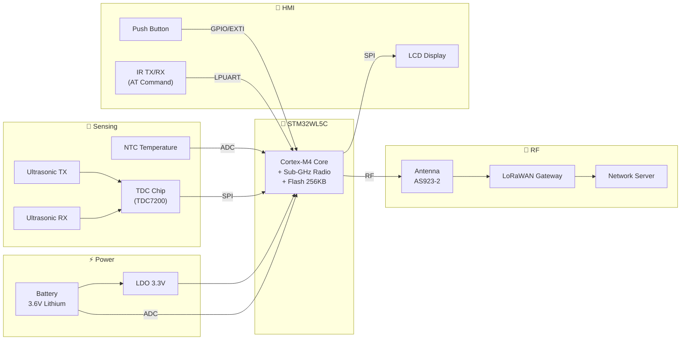
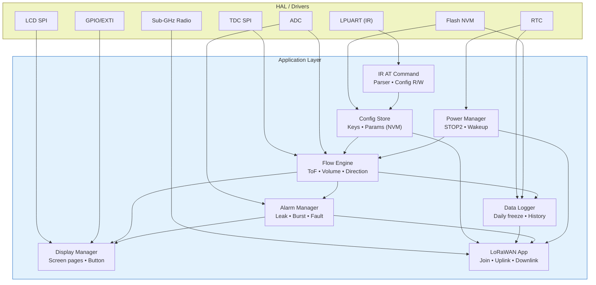
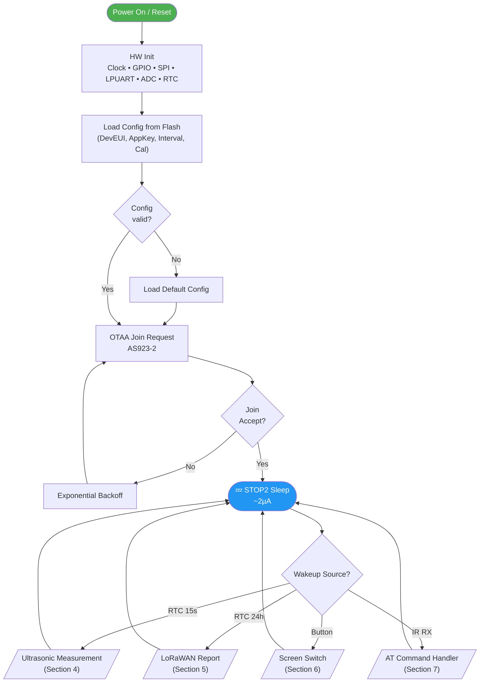
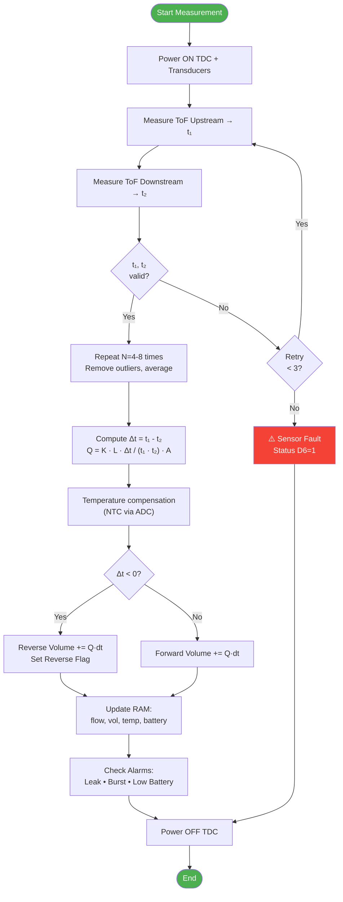
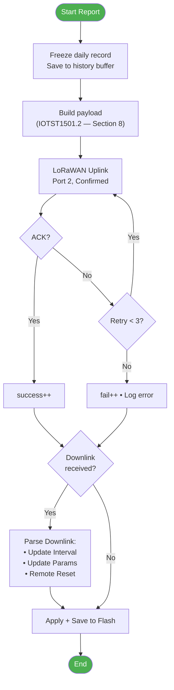
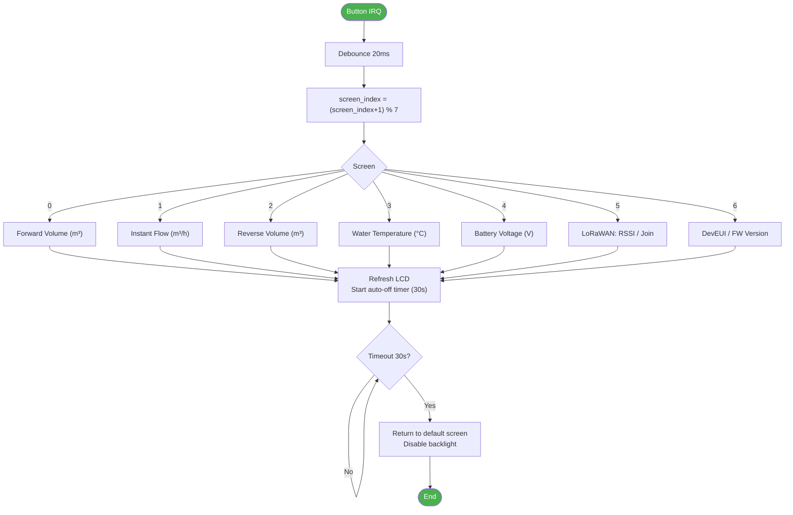
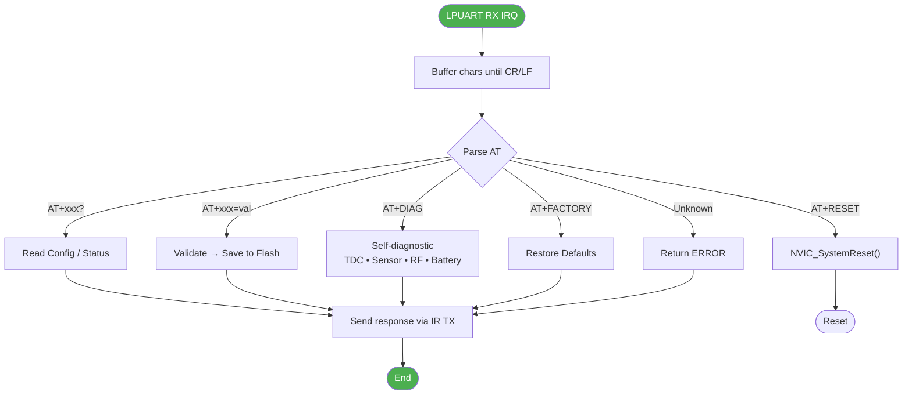

# Firmware Architecture — AVC Ultrasonic Water Meter

**MCU:** STM32WL5C  •  **Radio:** LoRaWAN AS923-2 (Vietnam)  •  **Pipe:** DN15

---

## 1. System Block Diagram

---

## 2. Firmware Architecture (HAL + Application)

---

## 3. Main Firmware Flowchart

---

## 4. Ultrasonic Measurement (Time-of-Flight)

---

## 5. LoRaWAN Report

---

## 6. Button Handling — Screen Switching

---

## 7. IR AT Command Handler

---

## 8. Uplink Payload Structure (IOTST1501.2)

### 8.1 Frame layout

| Offset | Field | Size | Description |
|---:|---|---:|---|
| 0 | Start | 1 B | `0x68` |
| 1 | Type | 1 B | Instrument type (`0x10`) |
| 2 | Address | 7 B | BCD little-endian |
| 9 | Control | 1 B | `0x81` |
| 10 | Length | 1 B | Data field length |
| 11 | Data Header | 11 B | DI0, DI1, SER, timestamp, protocol no. |
| 22 | Forward Volume | 5 B | Unit + 4 B BCD value |
| 27 | Reverse Volume | 5 B | Unit + 4 B BCD value |
| 32 | Instant Flow | 5 B | Unit + 4 B BCD value |
| 37 | Water Temperature | 4 B | Signed, 0.01 °C |
| 41 | Working Time | 2 B | Hours |
| 43 | Battery Voltage | 2 B | Unit 0.01 V |
| 45 | Status Word 1 + 2 | 4 B | Faults / mode bits |
| 49 | Daily History | N · 14 B | Frozen records |
| ... | Comm Stats | 14 B | Intervals, success/fail counters, RSSI |
| ... | Identifiers | 22 B | ICCID, IMEI, protocol version |
| -2 | Checksum (CS) | 1 B | Sum of bytes mod 256 |
| -1 | End | 1 B | `0x16` |

### 8.2 Sequence diagram (frame composition)

```mermaid
flowchart LR
    F1["0x68<br/>Start"] --> F2["Type<br/>0x10"] --> F3["Addr<br/>7 B"] --> F4["Ctrl<br/>0x81"] --> F5["Len"]
    F5 --> F6["Data Header<br/>11 B"] --> F7["Fwd Vol<br/>5 B"] --> F8["Rev Vol<br/>5 B"] --> F9["Flow<br/>5 B"]
    F9 --> F10["Temp<br/>4 B"] --> F11["WorkTime<br/>2 B"] --> F12["Vbat<br/>2 B"] --> F13["Status<br/>4 B"]
    F13 --> F14["Daily<br/>History"] --> F15["Comm<br/>Stats"] --> F16["IDs<br/>ICCID/IMEI"] --> F17["CS"] --> F18["0x16<br/>End"]
```

### 8.3 Status Word 1 (bit definitions)

| Bit | Name | Description |
|---:|---|---|
| D7 | Direction | `0` Forward / `1` Reverse |
| D6 | Flow sensor / air-in-pipe | `0` OK / `1` Fault |
| D5 | Temperature sensor | `0` OK / `1` Fault |
| D4 | Pipe leak | `0` OK / `1` Detected |
| D3 | Pipe burst | `0` OK / `1` Detected |
| D2 | Main power | `0` Normal / `1` Under-voltage |
| D1–D0 | Reserved | — |

---

## 9. Operating Modes & Power Profile

| Mode | Trigger | Duration | Current | Notes |
|---|---|---|---:|---|
| **STOP2 Sleep** | Default | ~99.9% | ~2 µA | RAM retained, RTC running |
| **Measure** | RTC 15 s | ~50 ms | ~15 mA | ToF + flow calc |
| **Report** | RTC 24 h | 2–5 s | ~120 mA (TX) | LoRaWAN uplink |
| **Display** | Button | 30 s | ~5 mA | LCD active |
| **IR Config** | IR RX | Per session | ~10 mA | AT command R/W |
| **Join** | Boot / Rejoin | 3–10 s | ~120 mA (TX) | OTAA |

**Wakeup sources from STOP2:** RTC Alarm A (measure), RTC Alarm B (report), EXTI button, LPUART RX (IR).

---

## 10. AT Command Set (IR Interface)

| Command | Description |
|---|---|
| `AT` | Connection test → `OK` |
| `AT+DEVEUI?` / `AT+DEVEUI=<hex>` | Read / Write DevEUI |
| `AT+APPEUI?` / `AT+APPEUI=<hex>` | Read / Write JoinEUI |
| `AT+APPKEY=<hex>` | Write AppKey (32 hex chars) |
| `AT+REGION?` / `AT+REGION=AS923_2` | Read / Write region |
| `AT+INTERVAL?` / `AT+INTERVAL=<min>` | Read / Write report interval |
| `AT+FLOWCAL?` / `AT+FLOWCAL=<K>,<off>` | Read / Write calibration |
| `AT+STATUS?` | Volume • Flow • Temp • Battery • RSSI |
| `AT+DIAG` | Self-diagnostic |
| `AT+VER?` | Firmware version |
| `AT+RESET` | Software reset |
| `AT+FACTORY` | Factory reset |
