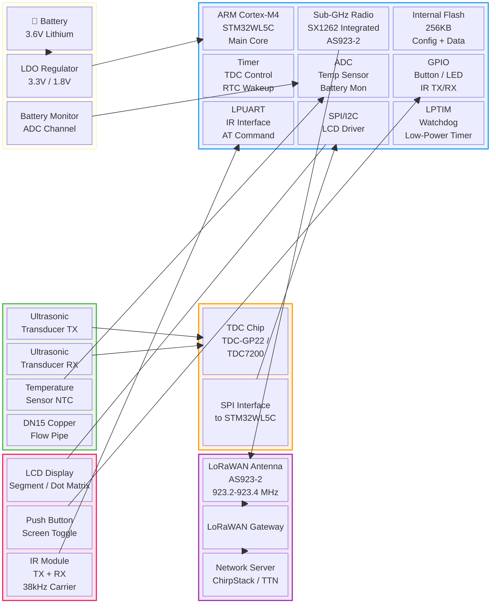
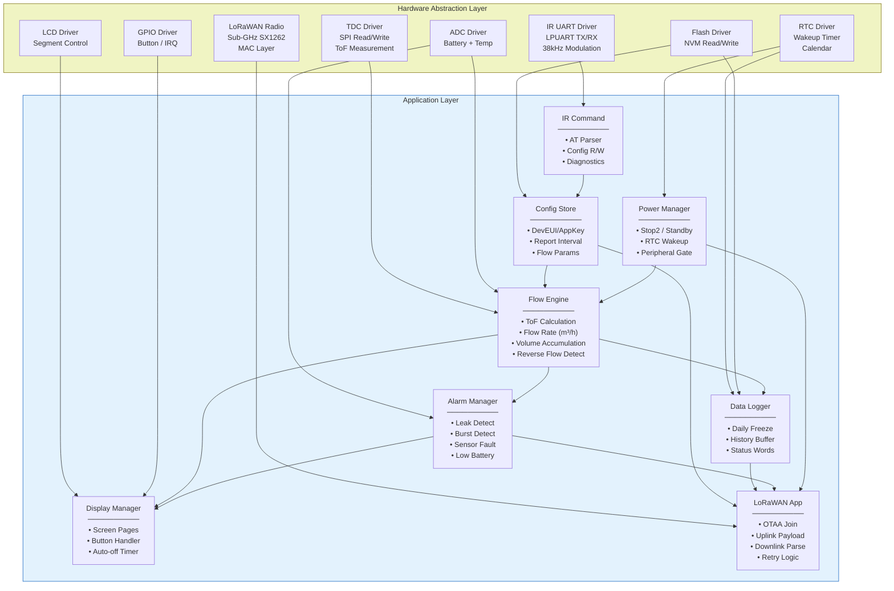
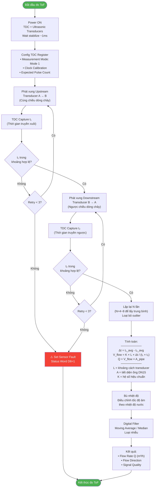
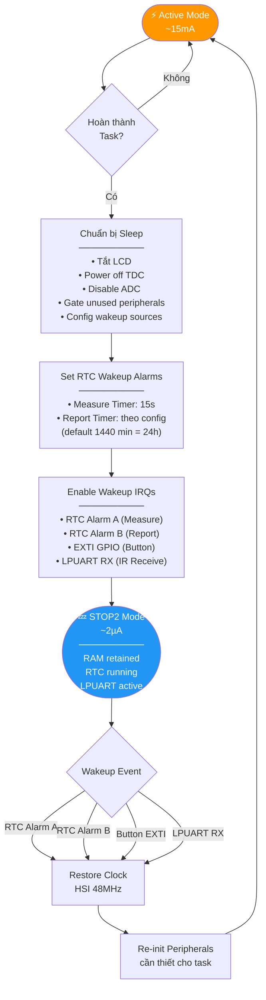

# AVC Ultrasonic Water Meter - Firmware Architecture

## MCU: STM32WL5C | LoRaWAN AS923-2 (Việt Nam) | DN15

---

## 1. Sơ đồ khối hệ thống (System Block Diagram)

---

## 2. Sơ đồ khối chức năng firmware (Firmware Functional Block Diagram)

---

## 3. Lưu đồ giải thuật chính (Main Firmware Flowchart)

```mermaid
flowchart TD
    START([🔌 Power On / Reset]) --> HW_INIT

    subgraph INIT["KHỞI TẠO HỆ THỐNG"]
        HW_INIT["Hardware Init<br/>─────────<br/>• Clock Config HSI/LSE<br/>• GPIO Init<br/>• SPI Init (TDC + LCD)<br/>• LPUART Init (IR)<br/>• ADC Init<br/>• RTC Init"]
        HW_INIT --> LOAD_CFG["Load Configuration<br/>from Flash NVM<br/>─────────<br/>• DevEUI, JoinEUI, AppKey<br/>• Report Interval<br/>• Flow Calibration Params<br/>• Screen Settings"]
        LOAD_CFG --> CHK_CFG{Config<br/>Valid?}
        CHK_CFG -- Không --> DEF_CFG["Load Default Config<br/>Save to Flash"]
        CHK_CFG -- Có --> TDC_INIT
        DEF_CFG --> TDC_INIT
        TDC_INIT["Init TDC Chip<br/>─────────<br/>• SPI Handshake<br/>• Calibration Registers<br/>• Clock Config"]
        TDC_INIT --> LCD_INIT["Init LCD Display<br/>Show Startup Screen"]
        LCD_INIT --> LORA_INIT
    end

    subgraph LORA_JOIN["LORAWAN JOIN"]
        LORA_INIT["Init LoRaWAN Stack<br/>Sub-GHz Radio<br/>AS923-2 Band Plan"]
        LORA_INIT --> JOIN_REQ["Gửi OTAA Join Request<br/>DevEUI + JoinEUI + AppKey"]
        JOIN_REQ --> JOIN_OK{Join<br/>Accept?}
        JOIN_OK -- Không --> JOIN_RETRY{Retry<br/>< Max?}
        JOIN_RETRY -- Có --> JOIN_WAIT["Backoff Delay<br/>(Exponential)"]
        JOIN_WAIT --> JOIN_REQ
        JOIN_RETRY -- Không --> SLEEP_LONG["Deep Sleep<br/>Retry sau 1h"]
        SLEEP_LONG --> JOIN_REQ
        JOIN_OK -- Có --> JOINED["✅ Joined Network<br/>Save Session Keys"]
    end

    LORA_JOIN --> MAIN_LOOP

    subgraph MAIN_LOOP["VÒNG LẶP CHÍNH"]
        direction TB
        ENTER_STOP2["Vào chế độ STOP2<br/>Low-Power Mode<br/>~2µA"]
        ENTER_STOP2 --> WAKEUP{Nguồn<br/>Wakeup?}

        WAKEUP -- "RTC Measurement<br/>Timer (mỗi 15s)" --> MEASURE
        WAKEUP -- "RTC Report<br/>Timer (mỗi 24h)" --> REPORT
        WAKEUP -- "Button IRQ" --> BTN_HANDLE
        WAKEUP -- "IR UART RX" --> IR_HANDLE
    end

    subgraph MEASURE["ĐO LƯỜNG ULTRASONIC"]
        direction TB
        M1["Power On TDC + Transducers"]
        M1 --> M2["Đo ToF Upstream<br/>(TX→RX) = t₁"]
        M2 --> M3["Đo ToF Downstream<br/>(RX→TX) = t₂"]
        M3 --> M4["Tính Δt = t₁ - t₂"]
        M4 --> M5["Tính Flow Rate<br/>Q = K × (Δt / (t₁ × t₂))<br/>đơn vị: m³/h"]
        M5 --> M6{"Δt < 0?<br/>(Reverse Flow)"}
        M6 -- Có --> M7["Set Reverse Flag<br/>Cộng dồn Reverse Volume"]
        M6 -- Không --> M8["Cộng dồn Forward Volume<br/>forward_vol += Q × Δtime"]
        M7 --> M9
        M8 --> M9["Đọc nhiệt độ nước<br/>(NTC via ADC)"]
        M9 --> M10["Đọc điện áp Pin<br/>(ADC Channel)"]
        M10 --> M11["Kiểm tra Alarm<br/>─────────<br/>• Leak: flow > 0 liên tục > 24h<br/>• Burst: flow > Q4 đột ngột<br/>• Sensor fault: ToF out of range<br/>• Low battery: V < 3.1V"]
        M11 --> M12["Power Off TDC<br/>+ Transducers"]
        M12 --> ENTER_STOP2
    end

    subgraph REPORT["BÁO CÁO LORAWAN"]
        direction TB
        R1["Đóng gói Uplink Payload<br/>──────────────<br/>Theo protocol IOTST1501.2"]
        R1 --> R1A["Payload Structure:<br/>• Header: 68H + Type + Addr<br/>• Forward Vol (5 bytes)<br/>• Reverse Vol (5 bytes)<br/>• Instant Flow (5 bytes)<br/>• Temperature (4 bytes)<br/>• Working Time (2 bytes)<br/>• Voltage (2 bytes)<br/>• Status Words (4 bytes)<br/>• Daily Frozen Records<br/>• Comm Statistics<br/>• RSSI + Module Info<br/>• Checksum + End 16H"]
        R1A --> R2["Freeze Daily Record<br/>Lưu vào History Buffer"]
        R2 --> R3["Gửi Uplink<br/>Confirmed / Unconfirmed<br/>Port 2, SF7-SF12"]
        R3 --> R4{ACK<br/>nhận?}
        R4 -- Có --> R5["Cập nhật Statistics<br/>success_count++<br/>Reset retry"]
        R4 -- Không --> R6{Retry<br/>< 3?}
        R6 -- Có --> R3
        R6 -- Không --> R5A["fail_count++<br/>Log Error"]
        R5 --> R7
        R5A --> R7
        R7{Có Downlink<br/>Command?}
        R7 -- Có --> R8["Parse Downlink<br/>──────────<br/>• Update Report Interval<br/>• Update Config Params<br/>• Remote Reset<br/>• Valve Control (nếu có)"]
        R8 --> R9["Apply & Save Config"]
        R7 -- Không --> R9
        R9 --> ENTER_STOP2
    end

    subgraph BTN_HANDLE["XỬ LÝ NÚT ẤN"]
        direction TB
        B1["Debounce Filter<br/>(20ms)"]
        B1 --> B2["screen_index++<br/>screen_index %= MAX_SCREENS"]
        B2 --> B3{"Screen<br/>Index?"}
        B3 -- "0" --> B3A["📟 Lưu lượng tích lũy<br/>Forward Volume (m³)"]
        B3 -- "1" --> B3B["📟 Lưu lượng tức thời<br/>Instant Flow (m³/h)"]
        B3 -- "2" --> B3C["📟 Reverse Volume<br/>(m³)"]
        B3 -- "3" --> B3D["📟 Nhiệt độ nước<br/>(°C)"]
        B3 -- "4" --> B3E["📟 Điện áp Pin<br/>(V)"]
        B3 -- "5" --> B3F["📟 Trạng thái LoRaWAN<br/>RSSI / Join Status"]
        B3 -- "6" --> B3G["📟 Device Info<br/>DevEUI / FW Version"]
        B3A & B3B & B3C & B3D & B3E & B3F & B3G --> B4["Cập nhật LCD<br/>Start Auto-off Timer (30s)"]
        B4 --> B5{Auto-off<br/>Timeout?}
        B5 -- Có --> B6["Tắt LCD Backlight<br/>Về default screen"]
        B5 -- Không --> B5
        B6 --> ENTER_STOP2
    end

    subgraph IR_HANDLE["XỬ LÝ IR COMMAND"]
        direction TB
        I1["LPUART nhận data<br/>qua IR Receiver (38kHz)"]
        I1 --> I2["Buffer AT Command<br/>until CR/LF"]
        I2 --> I3{Parse AT<br/>Command}
        I3 -- "AT+READ?" --> I4["Trả về Config hiện tại<br/>──────────<br/>DevEUI, AppKey, JoinEUI<br/>Report Interval, Region<br/>Flow Cal Params, FW Ver"]
        I3 -- "AT+SET=..." --> I5["Validate & Save<br/>Config to Flash<br/>──────────<br/>AT+DEVEUI=xxxx<br/>AT+APPKEY=xxxx<br/>AT+INTERVAL=1440<br/>AT+REGION=AS923_2<br/>AT+FLOWCAL=K,offset"]
        I3 -- "AT+DIAG" --> I6["Chạy Self-Diagnostic<br/>──────────<br/>TDC Check, Sensor Check<br/>Battery Level, Flash CRC<br/>LoRaWAN Radio Test"]
        I3 -- "AT+RESET" --> I7["System Reset<br/>NVIC_SystemReset()"]
        I3 -- "AT+FACTORY" --> I8["Factory Reset<br/>Restore Default Config"]
        I3 -- "Unknown" --> I9["Trả về ERROR"]
        I4 & I5 & I6 & I7 & I8 & I9 --> I10["Gửi Response<br/>qua IR Transmitter"]
        I10 --> ENTER_STOP2
    end

    style START fill:#4CAF50,color:#fff
    style INIT fill:#E3F2FD,stroke:#1565C0
    style LORA_JOIN fill:#F3E5F5,stroke:#7B1FA2
    style MAIN_LOOP fill:#FFF8E1,stroke:#F57F17
    style MEASURE fill:#E8F5E9,stroke:#2E7D32
    style REPORT fill:#FCE4EC,stroke:#C62828
    style BTN_HANDLE fill:#FFF3E0,stroke:#E65100
    style IR_HANDLE fill:#F1F8E9,stroke:#33691E
```

---

## 4. Lưu đồ chi tiết: Đo Ultrasonic ToF (Time-of-Flight)

---

## 5. Lưu đồ: Quản lý năng lượng (Power Management)

---

## 6. Cấu trúc Uplink Payload (IOTST1501.2)

```mermaid
graph LR
    subgraph FRAME["LoRaWAN Uplink Frame Structure"]
        direction LR
        F1["68H<br/>Start"] --> F2["Type<br/>10H"]
        F2 --> F3["Address<br/>A0-A6<br/>7 bytes BCD"]
        F3 --> F4["Ctrl<br/>81H"]
        F4 --> F5["Length<br/>L"]
        F5 --> F6["Data Block<br/>DI0 DI1 SER<br/>+ Timestamp<br/>+ Protocol No"]
        F6 --> F7["Forward Vol<br/>5 bytes"]
        F7 --> F8["Reverse Vol<br/>5 bytes"]
        F8 --> F9["Instant Flow<br/>5 bytes"]
        F9 --> F10["Temp<br/>4 bytes"]
        F10 --> F11["Work Time<br/>2 bytes"]
        F11 --> F12["Voltage<br/>2 bytes"]
        F12 --> F13["Status<br/>4 bytes"]
        F13 --> F14["Daily<br/>History<br/>Records"]
        F14 --> F15["Comm<br/>Stats"]
        F15 --> F16["CS<br/>Checksum"]
        F16 --> F17["16H<br/>End"]
    end

    style FRAME fill:#fafafa,stroke:#333
```

---

## 7. Bảng tổng hợp chế độ hoạt động

| Chế độ | Trigger | Thời gian hoạt động | Dòng tiêu thụ | Mô tả |
|---|---|---|---|---|
| **STOP2 Sleep** | Mặc định | ~99.9% thời gian | ~2 µA | RAM giữ, RTC chạy |
| **Measure** | RTC 15s | ~50 ms | ~15 mA | Đo ToF + tính flow |
| **Report** | RTC 1440 min | ~2-5 s | ~120 mA (TX) | LoRaWAN uplink |
| **Display** | Button press | ~30 s (auto-off) | ~5 mA | LCD hiển thị |
| **IR Config** | IR RX detect | Theo session | ~10 mA | AT command R/W |
| **Join** | Boot / Rejoin | ~3-10 s | ~120 mA (TX) | OTAA Join |

---

## 8. Danh sách AT Commands (IR Interface)

| Command | Mô tả | Ví dụ |
|---|---|---|
| `AT` | Test connection | Response: `OK` |
| `AT+DEVEUI?` | Đọc DevEUI | `+DEVEUI:0011223344556677` |
| `AT+DEVEUI=<hex>` | Ghi DevEUI | `AT+DEVEUI=0011223344556677` |
| `AT+APPEUI?` | Đọc JoinEUI/AppEUI | `+APPEUI:...` |
| `AT+APPEUI=<hex>` | Ghi JoinEUI/AppEUI | |
| `AT+APPKEY?` | Đọc AppKey | (masked output) |
| `AT+APPKEY=<hex>` | Ghi AppKey | 32 hex chars |
| `AT+REGION?` | Đọc Region | `+REGION:AS923_2` |
| `AT+REGION=<val>` | Ghi Region | `AT+REGION=AS923_2` |
| `AT+INTERVAL?` | Đọc Report Interval | `+INTERVAL:1440` (phút) |
| `AT+INTERVAL=<min>` | Ghi Report Interval | `AT+INTERVAL=720` |
| `AT+FLOWCAL?` | Đọc Flow Cal Params | `+FLOWCAL:K=1.000,OFF=0` |
| `AT+FLOWCAL=<K>,<off>` | Ghi Flow Cal | |
| `AT+STATUS?` | Đọc trạng thái | Vol, Flow, Temp, Bat, RSSI |
| `AT+DIAG` | Self-diagnostic | Check all subsystems |
| `AT+RESET` | Software Reset | |
| `AT+FACTORY` | Factory Reset | Restore defaults |
| `AT+VER?` | Firmware Version | `+VER:1.1.0` |
